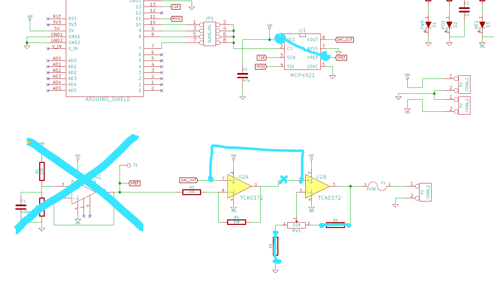

# Voyant Power DAC Array

Provides an array of digitally controllable power supplies that can each source 0V-10V at 100mA with +/-20mV accuracy. 

## Theory of operation

We use a stack of modified [Visgence Power DAC shield](https://www.visgence.com/hardware/powerdacshield/)s and an Arduino Uno as our base.

There is a sketch that runs on the Arduino that accepts serial commands to control the output voltages on the DAC boards. 

## Quick Start

1. Connect a dual-sided +/-12V power supply to the DAC headers. Red and green LEDs on DACs should light up. 
3. Plug the stack into a USB port on a host. Blue LEDs on DACs and the Arduino should light up. 
2. Set serial port on host to 1,000,000 baud, N, 8 , 1.
3. Send the command "V61.234" and press enter. 
4. The output on board `6 `should read 1.234 volts (+/-20mV).

## Power supply voltage inputs

The DAC boards take both a positive and negative input voltage. They are currently calibrated to a 12V positive input voltage. The negative input voltage is not important as long as it is between about -0.5V and -15V.

All the DAC voltage inputs are internally connected together to save wiring. 

The power supply should be connected as close as possible to the boards that will source the most current to avoid voltage drops.     
   
## Command set

All commands are ASCII text terminated with either `CR` or `NL` or both.

All command will generate a response line that begins with the response code followed by human readable response text. 

### Set Voltage Command

Sets the DAC on the specified board to generate the closest matching output voltage. Should be between "0" and "10". Note that there about 2000 discrete steps between 0 volts and 10 volts.  

| Bytes | Value | Meaning |
| - | - | - | 
| 1 | 'V' | Indicates the "Set voltage" command
| 1 | tag | The one char tag of the output to set (typically '0'='6' as defined in `powerboards`)
| n | voltage | The voltage to set to as a floating point number with optional decimal point     

Example:
`V39.950` would set the output on board `3` to 9.950 volts. 

### Set Steps Command

Sets the DAC on the specified board to the specified value. Note that there about 4096 discrete steps between the negative and positive endpoints, which are depenant on both the positive supply voltage and the trim pot setting.

| Bytes | Value | Meaning |
| - | - | - | 
| 1 | 'S' | Indicates the "Set steps" command
| 1 | tag | The one char tag of the output to set (typically '0'='6' as defined in `powerboards`)
| n | step | The step as an integer between 0 and 4095     

Example:
`V22047` would set the output on board `2` to approximately the middle of its output voltage range.  

### Delay Command

Delays the specified number of milliseconds. 

| Bytes | Value | Meaning |
| - | - | - | 
| 1 | 'D' | Indicates the "Delay" command
| n | millis | The number of milliseconds as an integer between 0 and 65535. 

Example:
`D1000` would delay the processing of the next command for 1 second. 

## Calibration

The output voltage depends on the DAC step value, the input positive voltage, and the setting of the trim pot. To get maximum accuracy and precision the boards need to be calibrated anytime any of these change.

Calibration steps:

1. Set the input positive voltage. This voltage must be about 0.5V higher than the highest desired output voltage, and the closer it is to the desired output voltage the higher the output resolution. I use 12V because it is a standard voltage and gives plenty of headroom for cable losses.
2. Connect a precision voltmeter to the output of the board to be calibrated. 
3. Set the DAC to the maximum output voltage with the command "Sx4095" where `x` is the board tag. 
4. Adjust the trim pot so that the output voltage is as close to 10V as possible. 
5. Use the "set steps" command to find the DAC zero crossover step. Use the command "Sx2048" (where `x` is the board tag) to start around the middle of the DAC range and adjust the 2048 up or down until the output voltage is as close to 0 as possible (stay above 0 if you want to prevent negative output voltage).
6. Enter the zero cross step value into the `supplyboards` structure in the program.
7. Download the edited program into the Arduino for the new calibration to take effect.          
 
## Building a new stack from stock parts

The stock DAC shield schematic is [here](dac_shield.pdf).

We make the following changes...

1. We connect the `-` and `+` input voltages to pins `A0` and `A1` respectively. This just saves us form having to connect the supplies to every boar individually.
2. We create a "bottom" blank shield that does nothing except block the `A0` and `A1` lines from getting down to the Arduino.   
2. We move the feedback tap for the final opamp to the other side of the fuse. This corrects a design flaw that otherwise would cause the output voltage to sag as output current increased due to the series resistance of the fuse. Optionally, that feedback tap could be moved all the way to the load for more accuracy at higher currents (this essentially creates a Kelvin sensor line).  
3. We add additional chip select lines to jumper #4 so we can have more than 4 boards in a single stack.   

### Even more precision and accuracy

We can double the usable precision by making the output single ended, and we can increase the precision by using a more precise reference voltage for the DAC. 

We can do this with the following changes...

Basically we are...

1. Changing the DAC to use the Arduino 5V as VREF. This will let it go full scale and give us maximum resolution. We could even use a more precise voltage reference here. 
2. Moving the output of the DAC to feed directly into the positive 2nd stage of the output amp.
3. Changing that 2nd stage output amp into a variable gain amplifier with 2x gain in the center of the adjustment POT. 

## Shield rework steps

1. Remove U3 (741) completely from the socket. We will not use this chip
2. Add a jumper between U1 pin 1 and pin 6 on the bottom side of the PCB
3. Cut the trace between U2 pin 1 and pin 6 on the bottom side of the PCB  
3. Add a jumper between U2 pin 7 and pin 6 on the bottom side of the PCB
4. Short out R5 and R6 with jumpers or 0 ohm resistors

